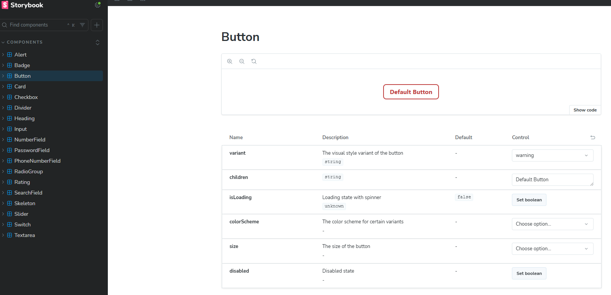

# ReviewAI - Frontend

AI-powered customer review analysis platform built with Next.js 14 for e-commerce support teams. Classifies sentiment, generates suggested responses, and tracks AI usage metrics.

**Tech Stack:** Next.js 14 | React 18 | TypeScript (strict) | Tailwind CSS 4 | Radix UI | Storybook 8

---

## Table of Contents

1. [Architecture & Project Structure](#1-architecture--project-structure)
2. [Layered Data Flow](#2-layered-data-flow)
3. [State Machine Hooks](#3-state-machine-hooks)
4. [Component Variant System](#4-component-variant-system)
5. [Design Token System](#5-design-token-system)
6. [Error Handling Pipeline](#6-error-handling-pipeline)
7. [Docker & GCP Deployment](#7-docker--gcp-deployment)
8. [Commands](#8-commands)

---

## 1. Architecture & Project Structure

App Router with `src/` convention. CSR-first — root layout is a Server Component (metadata + font), all page routes are Client Components for interactive state.

```
src/
├── app/                          # Routes (App Router)
│   ├── layout.tsx                # Server Component — Montserrat font, AppLayout shell
│   ├── page.tsx                  # /  — Review analysis
│   ├── history/page.tsx          # /history — Paginated review history + detail modal
│   ├── metrics/page.tsx          # /metrics — AI usage dashboard
│   └── usages/page.tsx           # /usages — Response tracking
│
├── components/ui/                # Atomic Design component library
│   ├── atoms/                    # Button, Badge, Card, Alert, Heading, Skeleton
│   ├── form-controls/            # Primitives + composites + field wrappers
│   ├── molecules/                # DataTable<T>, MetricCard, ReviewResult
│   ├── organisms/                # NavBar, ReviewForm, ReviewDetail, MetricsSummary
│   └── templates/                # AppLayout (NavBar + main container)
│
├── hooks/                        # Custom hooks (state machines per feature)
├── lib/api/                      # API abstraction layer
│   ├── api-client.ts             # Singleton HTTP client (fetch-based, typed generics)
│   ├── api-error.ts              # Typed ApiError class
│   ├── types.ts                  # ApiResponse<T> envelope
│   ├── dto/                      # DTOs per domain (review, metric, usage)
│   └── services/                 # Domain services (endpoint mapping)
├── styles/globals.css            # HSL design token system
└── stories/                      # 18 Storybook component stories
```

### Separation of Concerns

```
Page → Hook → Service → ApiClient → Backend API
         ↕ (useState)
    Component Tree
```

| Layer     | Location                | Role                               |
| --------- | ----------------------- | ---------------------------------- |
| UI        | `components/ui/`        | Rendering, interaction             |
| Logic     | `hooks/`                | State orchestration, data fetching |
| Data      | `lib/api/dto/`          | Type contracts (DTOs)              |
| Services  | `lib/api/services/`     | Endpoint mapping                   |
| Transport | `lib/api/api-client.ts` | HTTP client, error normalization   |

---

## 2. Layered Data Flow

### API Client — Singleton with Typed Generics

`ApiClient` wraps `fetch` with a generic response envelope. Every response passes through `processResponse<T>()`, which enforces the backend contract and throws typed errors:

```typescript
// Typed envelope — all backend responses conform to this shape
interface ApiResponse<T> {
  success: boolean;
  data: T | null;
  error: string | null;
  code: string | null;
  traceId: string;         // Backend correlation ID
}

// processResponse() — single exit point for error normalization
private async processResponse<T>(response: Response): Promise<ApiResponse<T>> {
  const result: ApiResponse<T> = await response.json();
  if (!result.success) {
    throw new ApiError(
      result.error ?? "An unexpected error occurred",
      (result.code as ApiErrorCode) ?? "INTERNAL_ERROR",
      response.status,
    );
  }
  return result;
}
```

### Domain Services — Thin Endpoint Mappers

Services contain zero logic — they map domain operations to HTTP calls:

| Service                | Endpoints                                                                                |
| ---------------------- | ---------------------------------------------------------------------------------------- |
| `reviewService`        | `POST /api/reviews`, `GET /api/reviews/history`, `GET /api/reviews/:id`                  |
| `reviewMetricsService` | `GET /api/review-metrics`, `GET /api/review-metrics/summary`                             |
| `reviewUsagesService`  | `GET /api/review-usages`, `POST /api/review-usages`, `PATCH /api/review-usages/:id/sent` |

---

## 3. State Machine Hooks

Each feature has a dedicated hook that acts as a self-contained state machine. No centralized store — state is co-located with the feature that consumes it.

### Pattern: `useReviewAnalysis`

Orchestrates a multi-step workflow (analyze -> edit response -> send) with explicit state transitions:

```typescript
const {
  result, // ReviewResponseDto | null
  isAnalyzing, // boolean — loading gate for analysis
  isSending, // boolean — loading gate for send
  error, // string | null
  sendSuccess, // boolean — terminal success state
  analyze, // (text, language?) => Promise<void>
  sendResponse, // (editedResponse) => Promise<void>
  reset, // () => void — returns to initial state
} = useReviewAnalysis();
```

`analyze()` and `sendResponse()` are `useCallback`-wrapped async functions that call domain services, manage transitions (`setIsAnalyzing` / `setIsSending`), and catch errors with typed discrimination (`instanceof ApiError`).

### Pattern: Paginated List Hooks

`useReviewHistory`, `useMetrics`, `useReviewUsages` share a common structure — server-side pagination (limit/offset, page size 20) with `nextPage()` / `prevPage()` controls and `useEffect` for initial fetch on mount.

---

## 4. Component Variant System

### CVA + Compound Variants

Components use **Class Variance Authority** to define a multi-axis variant API with type-safe props. The `Button` is the most complex example — 7 variants x 5 color schemes x 4 sizes with compound variants that resolve specific variant+colorScheme combinations:

```typescript
const buttonVariants = cva("base-classes", {
  variants: {
    variant: { default, primary, destructive, warning, link, outlined, menu },
    colorScheme: { default, info, success, warning, error },
    size: { small, default, large, icon },
    isLoading: { true, false },
  },
  compoundVariants: [
    // Each entry resolves a specific variant+colorScheme pair
    { variant: "primary", colorScheme: "success",
      class: "bg-green-80 hover:bg-green-90 ..." },
    { variant: "outlined", colorScheme: "error",
      class: "border-red-80 text-red-100 hover:bg-red-10 ..." },
    // ... 12 compound variant combinations
  ],
});
```

`isLoading` injects a spinner and disables the button without additional logic in the consumer.

### Generic DataTable\<T\>

Typed column definitions with render functions enable a single table component across all list views:

```typescript
interface DataTableColumn<T> {
  key: string;
  header: string;
  render: (item: T) => React.ReactNode; // Full control over cell rendering
}
```

Handles pagination, loading skeletons, empty states, and row click events generically.

---

## 5. Design Token System

`globals.css` defines an HSL-based token system with three layers:

**1. Palette scale** — 10 shades per color (Primary, Neutral, Success, Error, Warning, Info, Red, Orange, Green, Blue, Purple, Pink):

```css
--color-primary-10: hsl(190 100% 97%);
/* ... */
--color-primary-100: hsl(190 100% 15%);
```

**2. Semantic aliases** — map palette tokens to functional roles:

```css
--color-font-primary: hsl(210 50% 10%);
--color-font-interactive: hsl(190 95% 30%);
--color-bg-error: hsl(0 75% 95%);
--color-border-focus: hsl(190 100% 15%);
```

**3. Elevation shadows:**

```css
--shadow-soft: 0 2px 15px -3px rgba(0, 0, 0, 0.07), ...;
--shadow-medium: 0 4px 20px -2px rgba(0, 0, 0, 0.1), ...;
--shadow-hard: 0 10px 40px -5px rgba(0, 0, 0, 0.2), ...;
```

Class composition uses `cn()` — a `clsx` + `tailwind-merge` wrapper that resolves Tailwind class conflicts.

---

## 6. Error Handling Pipeline

Three-layer error propagation: **Transport -> Hook -> UI**.

```
ApiClient.processResponse()          — throws typed ApiError
  ↓
Hook try/catch                       — discriminates ApiError vs unknown
  ↓
Page <Alert variant="error">         — renders user-facing message
```

```typescript
// Typed error codes aligned with backend
type ApiErrorCode = "VALIDATION" | "NOT_FOUND" | "ALREADY_EXISTS" | "INTERNAL_ERROR";

class ApiError extends Error {
  public readonly code: ApiErrorCode;
  public readonly statusCode: number;
}

// Hook-level discrimination
catch (err) {
  const message = err instanceof ApiError
    ? err.message                              // Backend message
    : "Error inesperado al analizar el comentario";  // Generic fallback
  setError(message);
}
```

---

## 7. Docker & GCP Deployment

### Multi-Stage Dockerfile

```dockerfile
# Stage 1: Dependencies (pnpm install --frozen-lockfile)
FROM node:22-alpine AS deps

# Stage 2: Build (next build with NEXT_PUBLIC_API_BASE_URL ARG)
FROM node:22-alpine AS builder

# Stage 3: Production (standalone output, non-root user nextjs:1001, healthcheck)
FROM node:22-alpine
```

`output: "standalone"` in `next.config.mjs` produces a self-contained build — only `.next/standalone`, `.next/static`, and `public/` are copied to the final image.

### GCP Cloud Build + Cloud Run

Image target: `us-central1-docker.pkg.dev/<PROJECT_ID>/repo-frontend/sentiment-frontend`

IAM roles required for Cloud Build service account (`<PROJECT_NUMBER>@cloudbuild.gserviceaccount.com`):

| Role                           | Purpose                                  |
| ------------------------------ | ---------------------------------------- |
| `roles/artifactregistry.admin` | Push images to Artifact Registry         |
| `roles/storage.admin`          | Access underlying storage buckets        |
| `roles/run.admin`              | Deploy to Cloud Run                      |
| `roles/iam.serviceAccountUser` | Act as Cloud Run runtime service account |

> **Note:** This project uses Artifact Registry (`pkg.dev`), not the deprecated Container Registry (`gcr.io`).

---

## 8. Commands

### Setup & Development

```bash
pnpm install

# Dev server with Turbopack (http://localhost:3000)
pnpm dev
```

### Storybook

Interactive UI component documentation and playground available at `http://localhost:6006`.



### Build & Run

```bash
pnpm build
pnpm start
```

### Docker

```bash
# Docker Compose (maps 4000 -> 3000)
NEXT_PUBLIC_API_BASE_URL=https://api.example.com docker compose up --build

# Direct build
docker build --build-arg NEXT_PUBLIC_API_BASE_URL=https://api.example.com -t review-frontend .
docker run -p 4000:3000 review-frontend
```

### GCP Deployment

```bash
# Authenticate Docker with Artifact Registry
gcloud auth configure-docker us-central1-docker.pkg.dev

# Create Artifact Registry repository (first time only)
gcloud artifacts repositories create repo-frontend \
  --repository-format=docker \
  --location=us-central1

# Build and push via Cloud Build
gcloud builds submit \
  --config=cloudbuild.yaml \
  --substitutions=_NEXT_PUBLIC_API_BASE_URL="https://api.example.com"

# Deploy to Cloud Run
gcloud run deploy sentiment-frontend \
  --image=us-central1-docker.pkg.dev/<PROJECT_ID>/repo-frontend/sentiment-frontend \
  --region=us-central1 \
  --platform=managed \
  --port=3000 \
  --allow-unauthenticated
```

### Code Quality

```bash
pnpm lint
pnpm prettier
pnpm storybook:build
```
